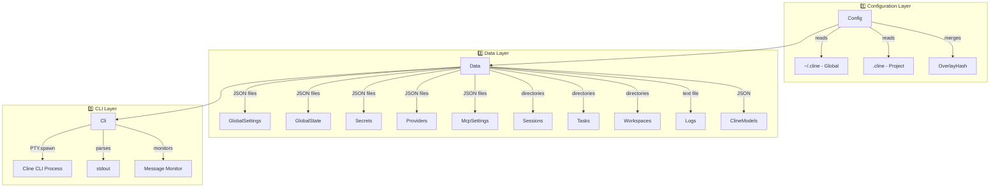
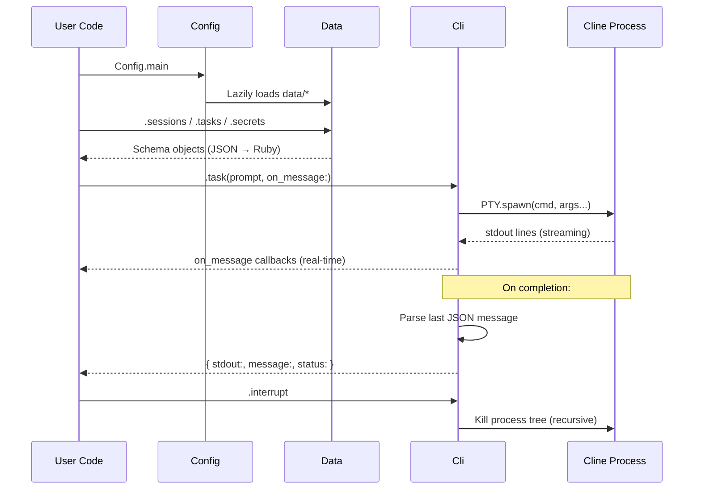

<div align="center">

# cline-rb

Ruby bindings for the [Cline](https://cline.bot/) AI assistant ecosystem — programmatically control the CLI, manage configurations, skills, sessions, tasks, models, logs, and secrets.

[](https://github.com/Muriel-Salvan/cline-rb/actions/workflows/continuous_integration.yml)
[](https://codecov.io/gh/Muriel-Salvan/cline-rb)
[](https://github.com/Muriel-Salvan/cline-rb/stargazers)
[](LICENSE)
[](https://badge.fury.io/rb/cline-rb)

</div>

**cline-rb** is a Ruby gem that gives you programmatic access to the [Cline](https://cline.bot/) AI assistant ecosystem. 🎯

Cline is an AI coding assistant that lives in your terminal. This library wraps its internals so you can:

* 🤖 **Launch & control** the Cline CLI from Ruby — run tasks, authenticate providers, and handle interactive sessions via PTY.
* 📂 **Read & write configuration** — access global (`~/.cline`), project (`.cline`), and VSCode extension data with a clean Ruby API.
* 🧠 **Manage skills, tasks & sessions** — list, enable/disable skills, monitor real-time task/session messages, and track token usage & costs.
* 🔐 **Handle secrets safely** — store and retrieve API keys for dozens of AI providers (OpenAI, Anthropic, Gemini, DeepSeek, Groq…).
* 📋 **Parse logs & global state** — read structured log entries, inspect auto-approval rules, browser settings, feature flags, and MCP configurations.
* ⏱️ **Watch for file changes** — monitor config files, logs, and data files for live updates.

Designed as a Ruby library (not a standalone CLI), **cline-rb** lets you build automation, testing tooling, custom dashboards, or integration scripts on top of the Cline ecosystem with minimal effort. ✨

## Table of contents

- [Quick start](#quick-start)
  - [Prerequisites](#prerequisites)
  - [Installation](#installation)
  - [Configuration (optional)](#configuration-optional)
  - [Reading Cline data](#reading-cline-data)
  - [Running a Cline task](#running-a-cline-task)
    - [Running a task with a specific model](#running-a-task-with-a-specific-model)
    - [Monitoring messages in real time](#monitoring-messages-in-real-time)
    - [Handling interactive sessions (questions from the assistant)](#handling-interactive-sessions-questions-from-the-assistant)
  - [Authentication](#authentication)
  - [Reading logs](#reading-logs)
  - [Interrupting a running task](#interrupting-a-running-task)
- [Requirements](#requirements)
- [Features](#features)
- [Public API](#public-api)
  - [`Cline` — top-level module](#cline--top-level-module)
    - [`Cline.configure`](#clineconfigure)
    - [`Cline.config`](#clineconfig)
    - [`Cline::VERSION`](#clineversion)
  - [`Cline::Configuration` — gem configuration](#clineconfiguration--gem-configuration)
  - [`Cline::Cli` — CLI wrapper](#clinecli--cli-wrapper)
    - [`Cli#initialize(stdout_echo: false, **kwargs)`](#cliinitializestdout_echo-false-kwargs)
    - [`Cli#task(prompt, on_message: nil, on_question: nil, monitoring_interval_secs: 1, **kwargs)`](#clitaskprompt-on_message-nil-on_question-nil-monitoring_interval_secs-1-kwargs)
    - [`Cli#auth(**kwargs)`](#cliauthkwargs)
    - [`Cli#interrupt`](#cliinterrupt)
    - [`Cli#cline_pid` / `Cli#session`](#clicline_pid--clisession)
  - [`Cline::Config` — Cline configuration directory](#clineconfig--cline-configuration-directory)
    - [`Config.main`](#configmain)
    - [`Config.global`](#configglobal)
    - [`Config.project`](#configproject)
    - [`Config#skills(create: false)`](#configskillscreate-false)
    - [`Config#data(create: false)`](#configdatacreate-false)
    - [`Config#cli(**kwargs)`](#configclikwargs)
    - [`Config#refresh!`](#configrefresh)
  - [`Cline::OverlayHash` — layered hash](#clineoverlayhash--layered-hash)
  - [`Cline::Data` — Cline data directory](#clinedata--cline-data-directory)
    - [`Data.vscode`](#datavscode)
  - [`Cline::Skill` — individual skill](#clineskill--individual-skill)
  - [`Cline::Skills` — collection of skills](#clineskills--collection-of-skills)
  - [`Cline::Session` — a Cline session](#clinesession--a-cline-session)
  - [`Cline::SessionData` — session metadata JSON](#clinesessiondata--session-metadata-json)
  - [`Cline::SessionMessage` — individual session message](#clinesessionmessage--individual-session-message)
  - [`Cline::SessionMessages` — session messages file](#clinesessionmessages--session-messages-file)
  - [`Cline::Task` — a Cline task](#clinetask--a-cline-task)
  - [`Cline::TaskMessage` — individual task message](#clinetaskmessage--individual-task-message)
  - [`Cline::Logs` — log file](#clinelogs--log-file)
  - [`Cline::Log` — log entry schema](#clinelog--log-entry-schema)
  - [`Cline::Secrets` — API keys](#clinesecrets--api-keys)
  - [`Cline::Model` — cached model info](#clinemodel--cached-model-info)
  - [`Cline::GlobalState` — global Cline state](#clineglobalstate--global-cline-state)
  - [`Cline::GlobalSettings` — global settings](#clineglobalsettings--global-settings)
  - [`Cline::McpSettings` — MCP server settings](#clinemcpsettings--mcp-server-settings)
  - [`Cline::Providers` — provider configurations](#clineproviders--provider-configurations)
  - [`Cline::Workspace` — workspace data](#clineworkspace--workspace-data)
  - [`Cline::Usage` — token usage statistics](#clineusage--token-usage-statistics)
  - [`Cline::Schema` — base JSON schema class](#clineschema--base-json-schema-class)
  - [`Cline::FileContent` — skill file content](#clinefilecontent--skill-file-content)
  - [`Cline::Utils::FileMonitor` — file change monitor](#clineutilsfilemonitor--file-change-monitor)
- [Documentation](#documentation)
- [How it works](#how-it-works)
  - [Architecture overview](#architecture-overview)
  - [1️⃣ Auto-loading with Zeitwerk ⚡](#-auto-loading-with-zeitwerk-)
  - [2️⃣ Schema & Serialization (the core pattern) 🔌](#-schema--serialization-the-core-pattern-)
  - [3️⃣ Config — the entry point 🚪](#-config--the-entry-point-)
  - [4️⃣ CLI interaction — PTY-based process control 🤖](#-cli-interaction--pty-based-process-control-)
  - [5️⃣ File monitoring — polling-based change detection 👀](#-file-monitoring--polling-based-change-detection-)
  - [6️⃣ OverlayHash — merging global + project config 🔗](#-overlayhash--merging-global--project-config-)
  - [7️⃣ Skill management 📝](#-skill-management-)
  - [8️⃣ Secret handling 🔐](#-secret-handling-)
  - [Data flow (end-to-end) 🎯](#data-flow-end-to-end-)
- [Development](#development)
  - [Prerequisites](#prerequisites-1)
  - [Clone the repository](#clone-the-repository)
  - [Install dependencies](#install-dependencies)
  - [Project structure](#project-structure)
  - [Running tests](#running-tests)
  - [Using the Cline CLI stub in other project's test cases](#using-the-cline-cli-stub-in-other-projects-test-cases)
  - [Code linting](#code-linting)
  - [Code coverage](#code-coverage)
  - [Building the gem](#building-the-gem)
  - [Generating YARD documentation](#generating-yard-documentation)
  - [Common development tasks](#common-development-tasks)
- [Contributing](#contributing)
  - [📝 Issues](#-issues)
  - [🍴 Fork & Pull Request workflow](#-fork--pull-request-workflow)
  - [✅ Pull Request guidelines](#-pull-request-guidelines)
  - [🔍 CI & Quality gates](#-ci--quality-gates)
  - [📄 License](#-license)
  - [💬 Questions?](#-questions)
- [License](#license)

## Quick start

### Prerequisites

- **Ruby >= 3.1**
- **Cline CLI** installed and configured on your system (see [cline.bot](https://cline.bot/))

### Installation

Add the gem to your project's Gemfile:

```bash
$ bundle add cline-rb
```

Or install it globally:

```bash
$ gem install cline-rb
```

Then require the library:

```ruby
require 'cline'
```

### Configuration (optional)

Enable debug logging to see CLI interactions:

```ruby
Cline.configure do |config|
  config.debug = true
end
```

### Reading Cline data

Access the global configuration (`~/.cline`), project config (`.cline`), or the merged main config:

```ruby
# Main config (global + project merged)
config = Cline::Config.main

# Global config only
config = Cline::Config.global

# Project config only
config = Cline::Config.project

# List available skills
config.skills&.each do |name, skill|
  puts "#{name}: #{skill.enabled? ? 'enabled' : 'disabled'}"
end

# List recent sessions
config.data.sessions.each do |id, session|
  puts "[#{session.status}] #{session.model} - #{session.session_id}"
  puts "  Tokens: #{session.data.metadata.usage&.input_tokens} in / #{session.data.metadata.usage&.output_tokens} out" if session.data&.metadata&.usage
end

# List tasks
config.data.tasks.each do |id, task|
  puts "Task #{id}: #{task.messages&.first&.text&.slice(0..80)}"
end

# Read stored API keys (returned as SecretString, redacted on inspect)
secrets = config.data.secrets
puts secrets.open_ai_api_key  # => "sk-...********" (redacted)

# Read cached model information
models = config.data.cline_models
puts models.keys  # e.g. ["gpt-4o", "claude-sonnet-4-6", ...]
```

### Running a Cline task

Use `Cline::Cli` to launch the Cline CLI, send a prompt, and collect the result:

```ruby
cli = Cline::Cli.new(stdout_echo: true)

result = cli.task('Explain what Ruby symbols are in one sentence.')

puts result[:stdout]     # Full CLI output
puts result[:message]    # Last assistant message (SessionMessage object)
puts result[:status]     # e.g. "completed"
puts result[:error]      # Error log entry if status is "failed"
```

#### Running a task with a specific model

```ruby
result = cli.task(
  'Refactor this code snippet: puts "hello"',
  model: 'claude-sonnet-4-6',
  provider: 'anthropic'
)
```

#### Monitoring messages in real time

```ruby
result = cli.task(
  'Write a Ruby script that reads a CSV file.',
  on_message: proc do |message, last, previous_version|
    puts "[#{message.say}] #{message.to_human(limit: 120)}"
  end
)
```

#### Handling interactive sessions (questions from the assistant)

```ruby
result = cli.task(
  'Create a new Rails API project',
  on_question: proc do |question|
    puts "Assistant asks: #{question.question}"
    'Use the default settings'
  end
)
```

### Authentication

Set up a provider's API key:

```ruby
cli = Cline::Cli.new
cli.auth(provider: 'openai-native', apikey: 'sk-...')
```

### Reading logs

```ruby
logs = config.data.logs
logs.logs.each do |entry|
  puts "[#{entry.time}] #{entry.msg}" if entry.is_a?(Cline::Log)
end

# Monitor logs in real time
logs.monitor(on_log: ->(log, _last) {
  puts log.msg if log.is_a?(Cline::Log)
}) do
  sleep 5
end
```

### Interrupting a running task

```ruby
cli.interrupt  # kills the running Cline process tree
```

## Requirements

- **Ruby** >= 3.1
- **Cline CLI** installed and available on your `PATH` (see [cline.bot](https://cline.bot/) for installation instructions)
- **Operating System**: Linux, macOS, or Windows (the gem includes platform-specific dependencies for each)
- **Bundler** (recommended) — to manage the gem dependency in your project via `bundle add cline-rb`

## Features

**cline-rb** is a Ruby library that wraps the [Cline](https://cline.bot/) AI assistant ecosystem, providing programmatic access to its CLI, configuration, data, and runtime — all through a clean Ruby API. Key capabilities include:

* 🤖 **CLI control** — Launch and drive the Cline CLI from Ruby via PTY: run tasks with custom models/providers, authenticate providers, handle interactive questions, and interrupt running sessions.
* 📂 **Configuration access** — Read and write Cline config from multiple sources (global `~/.cline`, project `.cline`, or custom paths). Merge global + project layers into a unified view.
* 🔐 **Secrets management** — Safely store and retrieve API keys for 30+ AI providers (OpenAI, Anthropic, Gemini, DeepSeek, Groq, Mistral, Together, etc.) using `SecretString` for secure in-memory handling.
* 🧠 **Skills management** — List, read, enable, and disable skills; inspect their YAML front matter and file contents.
* 📋 **Sessions & tasks** — Enumerate sessions and tasks from the data directory, read their structured messages, extract token usage, model info, and costs.
* ⏱️ **Real-time monitoring** — Subscribe to live updates on session messages, task messages, and log entries via file-change polling with callback-driven notifications.
* 📝 **Log parsing** — Read, parse, and append structured JSON log entries (error details, telemetry events, API call errors, etc.) with support for real-time log monitoring.
* ⚙️ **Global state inspection** — Access auto-approval rules, browser/viewport settings, feature flags, model configurations, API provider settings, workspace roots, and toggle states.
* 🔗 **MCP settings** — Read and write Model Context Protocol server configurations (type, URL, timeout, auto-approve tools).
* 🧩 **Provider config** — Read provider entries with API keys, model IDs, reasoning settings, and token sources.
* 💾 **Cached model info** — Access cached model metadata (context windows, pricing, image/cache support, thinking config).
* 📁 **Workspace settings** — Read per-workspace toggle states for skills, rules, and workflows.
* 🔄 **Configuration merging** — `OverlayHash` provides a layered Hash interface combining global and project configs.
* 📦 **VSCode support** — Access the VSCode extension's Cline data directory directly.
* 🛠️ **File change monitoring** — A background thread polls files at configurable intervals and fires callbacks on change — used across logs, sessions, tasks, and Cline data.
* 🏗️ **Schema-driven JSON serialization** — Domain objects (via `Shale`) handle automatic camelCase↔snake_case mapping, preserve extra attributes, and support round-trip JSON serialization.
* 💻 **Cross-platform** — OS-agnostic helpers for Linux and Windows (MinGW) covering executable paths, home directories, app data, and process tree management.
* 🐞 **Debug support** — Configurable debug mode enables verbose PTY output logging, temporary directory snapshots, and ANSI-sanitized logs.

## Public API

**cline-rb** is a Ruby library (no CLI executables). All public entry points are Ruby classes and methods under the `Cline` module.

---

### `Cline` — top-level module

#### `Cline.configure`

Configure the cline-rb gem behavior.

```ruby
Cline.configure do |config|
  config.debug = true
  config.temp_dir_root = '/tmp/my_debug'
end
```

[View source](https://github.com/Muriel-Salvan/cline-rb/blob/main/lib/cline.rb#L13-L15)

#### `Cline.config`

Get the current gem configuration (a `Cline::Configuration` instance).

```ruby
Cline.config.debug  #=> true or false
```

[View source](https://github.com/Muriel-Salvan/cline-rb/blob/main/lib/cline.rb#L18-L20)

#### `Cline::VERSION`

Gem version constant.

```ruby
Cline::VERSION  #=> "0.1.0"
```

---

### `Cline::Configuration` — gem configuration

| Attribute | Type | Description |
|---|---|---|
| `debug` | `Boolean` | Debug mode (defaults to `ENV['CLINE_DEBUG'] == '1'`) |
| `temp_dir_root` | `String` | Debug temp directory root (default: `.cline-rb/tmp`) |

[View source](https://github.com/Muriel-Salvan/cline-rb/blob/main/lib/cline/configuration.rb)

---

### `Cline::Cli` — CLI wrapper

Wraps the Cline CLI process via PTY. Create an instance and use it to run tasks, authenticate providers, or interrupt running commands.

```ruby
cli = Cline::Cli.new(stdout_echo: true)
```

#### `Cli#initialize(stdout_echo: false, **kwargs)`

Constructor. `kwargs` can include global options like `verbose`, `cwd`, or `config`.

```ruby
cli = Cline::Cli.new(stdout_echo: true, cwd: '/my/project')
```

#### `Cli#task(prompt, on_message: nil, on_question: nil, monitoring_interval_secs: 1, **kwargs)`

Start a task by sending a prompt to the Cline CLI. Returns `{ stdout:, message:, status:, error: }`.

```ruby
result = cli.task('Explain Ruby symbols in one sentence.', model: 'claude-sonnet-4-6')
puts result[:stdout]   # Full CLI output
puts result[:message]  # Last assistant SessionMessage
puts result[:status]   # e.g. "completed"
```

[View source](https://github.com/Muriel-Salvan/cline-rb/blob/main/lib/cline/cli.rb#L129-L237)

#### `Cli#auth(**kwargs)`

Authenticate a provider with the CLI.

```ruby
cli.auth(provider: 'openai-native', apikey: 'sk-...')
```

[View source](https://github.com/Muriel-Salvan/cline-rb/blob/main/lib/cline/cli.rb#L108-L110)

#### `Cli#interrupt`

Kill the currently running Cline process tree.

```ruby
cli.interrupt
```

[View source](https://github.com/Muriel-Salvan/cline-rb/blob/main/lib/cline/cli.rb#L246-L259)

#### `Cli#cline_pid` / `Cli#session`

Access the current Cline process PID and the last session handled.

---

### `Cline::Config` — Cline configuration directory

Access global (`~/.cline`), project (`.cline`), or merged configuration.

#### `Config.main`

Merged global + project config.

```ruby
config = Cline::Config.main
```

#### `Config.global`

Global config only (`~/.cline`).

```ruby
global = Cline::Config.global
```

#### `Config.project`

Project config only (`.cline`).

```ruby
project = Cline::Config.project
```

#### `Config#skills(create: false)`

Get skills (returns an `OverlayHash` combining global + project skills).

```ruby
config.skills&.each { |name, skill| puts name }
```

#### `Config#data(create: false)`

Get the `Data` object for this config.

```ruby
config.data.secrets     #=> Cline::Secrets
config.data.logs        #=> Cline::Logs
config.data.sessions    #=> Cline::Sessions
```

#### `Config#cli(**kwargs)`

Create a `Cli` instance attached to this config.

```ruby
config.cli(stdout_echo: true).task('Hello')
```

#### `Config#refresh!`

Clear cached objects to reload from disk.

[View source](https://github.com/Muriel-Salvan/cline-rb/blob/main/lib/cline/config.rb)

---

### `Cline::OverlayHash` — layered hash

Merges several Hash-like objects, with priority order for reads and writes to the first layer only.

```ruby
merged = Cline::OverlayHash.new(global_skills, project_skills)
merged['my_skill']  # retrieves from global first, falls back to project
```

Supports `each`, `[]`, `key?`, `keys`, `values`, `size`, `empty?`, `to_h`, `==`.

[View source](https://github.com/Muriel-Salvan/cline-rb/blob/main/lib/cline/overlay_hash.rb)

---

### `Cline::Data` — Cline data directory

Wraps the content of `~/.cline/data`. Provides accessors returning domain objects.

```ruby
data = Cline::Config.global.data
```

| Method | Returns |
|---|---|
| `#cline_models` | `Models` |
| `#global_settings` | `GlobalSettings` |
| `#global_state` | `GlobalState` |
| `#logs` | `Logs` |
| `#mcp_settings` | `McpSettings` |
| `#providers` | `Providers` |
| `#secrets` | `Secrets` |
| `#sessions` | `Sessions` |
| `#tasks` | `Tasks` |
| `#workspaces` | `Workspaces` |

#### `Data.vscode`

Get the VSCode Cline extension data directory.

```ruby
vscode_data = Cline::Data.vscode
```

[View source](https://github.com/Muriel-Salvan/cline-rb/blob/main/lib/cline/data.rb)

---

### `Cline::Skill` — individual skill

Represents a skill directory.

```ruby
skill = config.skills['my-skill']
skill.name          #=> "my-skill"
skill.enabled?      #=> true
skill.enable        # Enable the skill
skill.disable       # Disable the skill
skill.files         #=> { "SKILL.md" => #<FileContent>, ... }
skill.save          # Persist changes to disk
skill.yaml_front_matter  #=> { name: "...", ... }
```

[View source](https://github.com/Muriel-Salvan/cline-rb/blob/main/lib/cline/skill.rb)

---

### `Cline::Skills` — collection of skills

Enumerable + Hash-like interface over skill directories.

```ruby
skills = config.skills
skills.keys.each { |name| puts name }
skills.new('my-new-skill')  # Create a new skill directory
```

---

### `Cline::Session` — a Cline session

```ruby
session = config.data.sessions['session-id']
session.status        #=> "completed"
session.model         #=> "deepseek/deepseek-v4-flash"
session.data          #=> Cline::SessionData (metadata, usage, costs)
session.messages      #=> Cline::SessionMessages
session.monitor_messages(on_message: ->(msg, last, prev) { puts msg.to_human }) do
  sleep 5
end
```

The `Session` delegates `SessionData` attributes directly: `session_id`, `status`, `model`, `provider`, `started_at`, `ended_at`, etc.

[View source](https://github.com/Muriel-Salvan/cline-rb/blob/main/lib/cline/session.rb)

---

### `Cline::SessionData` — session metadata JSON

Contains `Metadata` (with `Usage`, `Checkpoint`, `CheckpointEntry`), version, session_id, source, pid, timestamps, status, model, provider, costs, etc.

```ruby
session.data.metadata.usage.input_tokens   #=> 1234
session.data.metadata.usage.total_cost     #=> 0.0023
```

---

### `Cline::SessionMessage` — individual session message

```ruby
msg = session.messages.first
msg.role          #=> "user" or "assistant"
msg.content       #=> Array of MessageContent blocks
msg.timestamp     #=> Time object
msg.usage         #=> Usage struct (cost, tokens)
msg.to_human      #=> human-friendly string (limited to 128 chars by default)
```

Contains nested schemas: `ModelInfo`, `Metrics`, `MessageContent`, `ToolUseInput`.

---

### `Cline::SessionMessages` — session messages file

Contains `version`, `updated_at`, `agent`, `session_id`, `messages` (array of `SessionMessage`), `system_prompt`.

---

### `Cline::Task` — a Cline task

```ruby
task = config.data.tasks['task-id']
task.messages                    #=> Cline::TaskMessages
task.monitor_messages(on_message: ->(msg, last, prev) { puts msg.to_human }) do
  sleep 5
end
```

[View source](https://github.com/Muriel-Salvan/cline-rb/blob/main/lib/cline/task.rb)

---

### `Cline::TaskMessage` — individual task message

```ruby
msg = task.messages.first
msg.ts            #=> Integer timestamp
msg.type          #=> "say" or "ask"
msg.say           #=> "text", "api_req_started", "tool", etc.
msg.text          #=> Raw text content
msg.timestamp     #=> Time object
msg.usage         #=> Usage struct (for api_req_started messages)
msg.to_human      #=> Human-friendly description
```

---

### `Cline::Logs` — log file

```ruby
logs = config.data.logs
logs.logs.each { |entry| puts "[#{entry.time}] #{entry.msg}" if entry.is_a?(Cline::Log) }

# Add a log entry
logs << Cline::Log.new(level: 30, time: Time.now.iso8601, msg: 'Hello', pid: 1234, hostname: 'myhost', name: 'myapp', component: 'main')
logs.save

# Monitor logs in real-time
logs.monitor(on_log: ->(log, _last) { puts log.msg }) { sleep 5 }
```

[View source](https://github.com/Muriel-Salvan/cline-rb/blob/main/lib/cline/logs.rb)

---

### `Cline::Log` — log entry schema

Attributes: `level`, `time`, `pid`, `hostname`, `name`, `component`, `msg`, `interactive`, `has_prompt`, `cwd`, `reason`, `backend_mode`, `force_local_backend`, `telemetry_sink`, `event`, `properties` (`Properties`), `severity`, `provider_id`, `err` (`Error`).

Nested schemas: `ErrorCause`, `ApiError`, `Error`, `Properties` (with ulid, api_provider, agent_id, team info, model info, platform info, etc.).

[View source](https://github.com/Muriel-Salvan/cline-rb/blob/main/lib/cline/log.rb)

---

### `Cline::Secrets` — API keys

Access stored API keys for 30+ AI providers. All values are `SecretString` (redacted on inspect).

```ruby
secrets = config.data.secrets
secrets.open_ai_api_key   #=> #<SecretString ...>
secrets.anthropic_api_key
secrets.gemini_api_key
secrets.deep_seek_api_key
# ... and many more
```

[View source](https://github.com/Muriel-Salvan/cline-rb/blob/main/lib/cline/secrets.rb)

---

### `Cline::Model` — cached model info

```ruby
model = config.data.cline_models['claude-sonnet-4-6']
model.name                #=> "Claude Sonnet 4.6"
model.max_tokens          #=> 8192
model.context_window      #=> 200000
model.input_price         #=> 3.0
model.output_price        #=> 15.0
model.supports_images     #=> true
model.supports_prompt_cache #=> true
model.thinking_config     #=> Cline::Model::ThinkingConfig (with max_budget)
```

---

### `Cline::GlobalState` — global Cline state

Access via `config.data.global_state`. Includes the following modules:

| Module | Provides |
|---|---|
| `AutoApproval` | `auto_approval_settings` (`AutoApprovalSettings` with actions toggles), `yolo_mode_toggled` |
| `Browser` | `browser_settings` (`BrowserSettings` with viewport, remote browser, chrome path) |
| `Workspace` | `workspace_roots` (array of `WorkspaceRoot`), `primary_root_index`, `multi_root_enabled` |
| `Features` | `focus_chain_settings`, `cline_web_tools_enabled`, `double_check_completion_enabled`, `subagents_enabled`, etc. |
| `ApiProviders` | `open_ai_headers`, `anthropic_base_url`, `request_timeout_ms`, `azure_api_version`, etc. |
| `General` | `welcome_view_completed`, `custom_prompt`, `cline_version`, `telemetry_setting`, `is_new_user`, etc. |
| `Toggles` | `remote_rules_toggles`, `global_skills_toggles`, `global_workflow_toggles`, etc. |
| `Models` | Mode-specific model configs (`act_mode_cline_model_id`, `plan_mode_cline_model_id`, etc.) |

[View source](https://github.com/Muriel-Salvan/cline-rb/blob/main/lib/cline/global_state.rb)

---

### `Cline::GlobalSettings` — global settings

```ruby
settings = config.data.global_settings
settings.auto_update_enabled   #=> true/false
settings.telemetry_opt_out     #=> true/false
settings.disabled_tools        #=> ["tool1", "tool2"]
```

---

### `Cline::McpSettings` — MCP server settings

```ruby
mcp = config.data.mcp_settings
mcp.mcp_servers['my-server'].type         #=> "sse" or "stdio"
mcp.mcp_servers['my-server'].url          #=> "https://..."
mcp.mcp_servers['my-server'].timeout      #=> 60
mcp.mcp_servers['my-server'].auto_approve #=> ["tool1", "tool2"]
mcp.mcp_servers['my-server'].disabled     #=> false
```

---

### `Cline::Providers` — provider configurations

```ruby
providers = config.data.providers
providers.version              #=> 1
providers.last_used_provider   #=> "anthropic"
providers.providers['anthropic'].settings.api_key    #=> SecretString
providers.providers['anthropic'].settings.model      #=> "claude-sonnet-4-6"
providers.providers['anthropic'].updated_at          #=> ISO 8601 timestamp
providers.providers['anthropic'].token_source        #=> "manual"
```

---

### `Cline::Workspace` — workspace data

```ruby
workspace = config.data.workspaces['workspace-id']
workspace.settings.local_skills_toggles       #=> { "skill1" => true }
workspace.settings.workflow_toggles           #=> { "wf1" => false }
```

---

### `Cline::Usage` — token usage statistics

A `Struct` with `cost`, `input_tokens`, `output_tokens`, `cache_read_tokens`, `cache_write_tokens`, `cline_model`.

```ruby
usage = msg.usage
usage.context_tokens       #=> input + output + cache reads + cache writes
usage.context_tokens_limit #=> model's context_window
```

[View source](https://github.com/Muriel-Salvan/cline-rb/blob/main/lib/cline/usage.rb)

---

### `Cline::Schema` — base JSON schema class

Base class for all domain objects. Provides JSON serialization with automatic camelCase↔snake_case mapping.

```ruby
class MyConfig < Cline::Schema
  attribute :my_field, :string
end

obj = MyConfig.of_hash({ "myField" => "value" })
obj.to_cline_json  #=> '{"myField":"value"}'
obj.to_hash        #=> { my_field: "value", extra_attributes: nil }
```

[View source](https://github.com/Muriel-Salvan/cline-rb/blob/main/lib/cline/schema.rb)

---

### `Cline::FileContent` — skill file content

```ruby
file = skill.files['SKILL.md']
file.content  #=> The raw file content
```

---

### `Cline::Utils::FileMonitor` — file change monitor

Polls a file for changes on a background thread.

```ruby
monitor = Cline::Utils::FileMonitor.new(
  'path/to/file.log',
  on_change: ->(mtime) { puts "File changed at #{mtime}" },
  monitoring_interval_secs: 2
)
monitor.start
# ... later ...
monitor.stop
```

[View source](https://github.com/Muriel-Salvan/cline-rb/blob/main/lib/cline/utils/file_monitor.rb)

## Documentation

- **[README.md](https://github.com/Muriel-Salvan/cline-rb/blob/main/README.md)** — Main project overview, installation, development and contributing instructions.
- **[RubyDoc.info](https://www.rubydoc.info/gems/cline-rb)** — Auto-generated API documentation for the `cline-rb` gem, with detailed class and method references from YARD doc comments.
- **[YARD API Documentation](https://github.com/Muriel-Salvan/cline-rb)** — Run `bundle exec yard doc` locally to generate HTML docs in the `doc/` directory. The project enforces 100% documented code via CI.
- **[CHANGELOG.md](https://github.com/Muriel-Salvan/cline-rb/blob/main/CHANGELOG.md)** — Release history, auto-generated by semantic-release.
- **[TODO.md](https://github.com/Muriel-Salvan/cline-rb/blob/main/TODO.md)** — Project roadmap and pending development tasks.
- **[LICENSE](https://github.com/Muriel-Salvan/cline-rb/blob/main/LICENSE)** — BSD 3-Clause License.
- **[GitHub Repository](https://github.com/Muriel-Salvan/cline-rb)** — Source code, issue tracker, and pull requests.
- **[Continuous Integration](https://github.com/Muriel-Salvan/cline-rb/blob/main/.github/workflows/continuous_integration.yml)** — CI workflow definition running tests, linting, and release automation.
- **[Documentation Specs](https://github.com/Muriel-Salvan/cline-rb/blob/main/spec/scenarios/documentation_spec.rb)** — RSpec tests verifying YARD documentation generation and 100% doc coverage.

## How it works

### Architecture overview

**cline-rb** is organized in **three layers** that mirror the Cline filesystem layout:



### 1️⃣ Auto-loading with Zeitwerk ⚡

The gem uses [Zeitwerk](https://github.com/fxn/zeitwerk) (`lib/cline.rb` line 3) for **convention-over-configuration** code loading. All classes under `lib/cline/` are auto-discovered and loaded on demand — no explicit `require` statements needed beyond `require 'cline'`.

### 2️⃣ Schema & Serialization (the core pattern) 🔌

Every domain object (settings, providers, sessions, tasks...) extends `Cline::Schema < Shale::Mapper` ([schema.rb](https://github.com/Muriel-Salvan/cline-rb/blob/main/lib/cline/schema.rb)). This provides:

- **Declarative attributes** — `attribute :my_field, :string` mirrors the JSON schema.
- **Automatic camelCase↔snake_case mapping** — Cline stores `autoUpdateEnabled`, Ruby gets `auto_update_enabled`.
- **Extra attribute preservation** — unknown JSON keys are stored in `extra_attributes` and re-serialized back, maintaining round-trip fidelity.

3 mixin modules handle file persistence — classes include them to "come alive" from disk:

| Mixin | Purpose |
|---|---|
| `Serializable::Dir` | Opens from a **directory** (config, sessions, tasks, skills) |
| `Serializable::File` | Opens from a single **file** (logs) |
| `Serializable::ClineData` | Opens from a **JSON file** relative to a base directory (settings, secrets, providers) |

### 3️⃣ Config — the entry point 🚪

`Cline::Config` ([config.rb](https://github.com/Muriel-Salvan/cline-rb/blob/main/lib/cline/config.rb)) is the main access point. It provides 3 static factories:

- `Config.global` — reads `~/.cline`
- `Config.project` — reads `.cline` (current directory)
- `Config.main` — merges global + project via `OverlayHash`

`Data` ([data.rb](https://github.com/Muriel-Salvan/cline-rb/blob/main/lib/cline/data.rb)) lazily loads sub-objects (sessions, tasks, secrets...) with per-attribute caching (`@variable ||= ...`).

### 4️⃣ CLI interaction — PTY-based process control 🤖

`Cline::Cli` ([cli.rb](https://github.com/Muriel-Salvan/cline-rb/blob/main/lib/cline/cli.rb)) wraps the Cline CLI binary using Ruby's `PTY.spawn`:

- 🏗️ Builds command-line arguments from a declarative `COMMANDS` hash (global options + task/auth options).
- 🔄 **Real-time monitoring** — streams stdout line-by-line via `reader.each_line`, calling `on_message`/`on_stdout` callbacks.
- 🛑 **Interrupt support** — kills the entire Cline process tree recursively (using `Sys::ProcTable`).
- 🧪 **Harvests results** — parses the last JSON output message, detects completion/failure/interactive-question states.
- 🐛 **Debug mode** — when `Cline.config.debug == true`, all CLI calls are logged with redacted output.

### 5️⃣ File monitoring — polling-based change detection 👀

`Utils::FileMonitor` ([file_monitor.rb](https://github.com/Muriel-Salvan/cline-rb/blob/main/lib/cline/utils/file_monitor.rb)) polls a file's mtime in a background `Thread.new` at configurable intervals. This is used by:
- `Task#monitor_messages` — detects new/updated task messages in `ui_messages.json`
- `Session#monitor_messages` — detects new/updated session messages in `*.messages.json`
- `Logs#monitor` — watches `cline.log` for new log entries

Thread-safe detection compares the current message state (keyed by timestamp) to detect updates vs. new messages.

### 6️⃣ OverlayHash — merging global + project config 🔗

`OverlayHash` ([overlay_hash.rb](https://github.com/Muriel-Salvan/cline-rb/blob/main/lib/cline/overlay_hash.rb)) implements a **layered hash pattern**:

- **Reads** — iterates layers in priority order, returns first match.
- **Writes** — always go to the top (global) layer.
- **Used by** — `Config#skills` merges global + project skills transparently.

### 7️⃣ Skill management 📝

Skills ([skill.rb](https://github.com/Muriel-Salvan/cline-rb/blob/main/lib/cline/skill.rb)) are directory-based, containing a `SKILL.md` file with YAML front matter. The gem:
- Parses YAML front matter using `front_matter_parser`.
- Detects `disabled: true` to determine enabled state.
- Provides `enable`/`disable` methods that rewrite the `SKILL.md` front matter in-place.
- Caches file discovery in an `@files` hash, lazily loaded.

### 8️⃣ Secret handling 🔐

`SecretString` ([secret_string.rb](https://github.com/Muriel-Salvan/cline-rb/blob/main/lib/cline/secret_string.rb)) wraps the `secret_string` gem (not Shale's native type) by providing custom `cast`, `as_hash`, and `of_hash` methods, so API keys are:
- **Redacted on inspect** — `"sk-...********"`
- **Stored securely** — using secret_string's safe memory handling

### Data flow (end-to-end) 🎯



## Development

### Prerequisites

- **Ruby >= 3.1** (the CI runs against Ruby 3.4)
- **Bundler** (`gem install bundler`)
- **Cline CLI** installed and available on your `PATH` (needed for integration tests — see [cline.bot](https://cline.bot/))
- **Node.js** (needed for `node-pty` on Windows — see `.gitignore`)

### Clone the repository

```bash
git clone https://github.com/Muriel-Salvan/cline-rb.git
cd cline-rb
```

### Install dependencies

```bash
bundle install
```

For local development you can create a `Gemfile.local` file (already provided in the project) that adds `debug` and `ruby-lsp` gems on top of the main dependencies. Bundler will pick it up automatically if present.

> **Note:** This is a Ruby gem, so `Gemfile.lock` is in `.gitignore` and not committed.

### Project structure

```
cline-rb/
├── lib/                  # Library source code (autoloaded via Zeitwerk)
│   ├── cline.rb          # Entry point — requires Zeitwerk loader
│   ├── cline/            # Core domain modules
│   │   ├── version.rb    # Gem version (Cline::VERSION)
│   │   ├── cli.rb        # CLI interaction (task, auth, interrupt)
│   │   ├── config.rb     # Configuration reader
│   │   ├── data.rb       # Cline data directory
│   │   ├── schema.rb     # Base JSON schema / serialization
│   │   ├── global_state/ # Global state sub-models (browser, toggles, features…)
│   │   ├── serializable/ # File/directory serialization mixins
│   │   └── utils/        # Utilities (file monitor, enumerable dir objects)
├── spec/                 # RSpec test suite
│   ├── spec_helper.rb    # Test bootstrap (SimpleCov, Zeitwerk loader, RSpec config)
│   ├── cline_test/       # Test support (helpers, CLI stub, mock configs)
│   └── scenarios/        # High-level scenario specs (packaging, code quality, docs)
├── tools/                # Compatibility check scripts
├── .rspec                # RSpec CLI options
├── .rubocop.yml          # RuboCop configuration
├── .releaserc            # semantic-release configuration
├── cline-rb.gemspec      # Gem specification
├── Gemfile               # Main Gemfile
└── Gemfile.local         # Local development Gemfile (adds debug, ruby-lsp)
```

### Running tests

The project uses **RSpec** (~> 3.13) with **SimpleCov** enforcing **98% minimum code coverage**.

```bash
# Run the full test suite
bundle exec rspec

# Run with documentation format (also used in CI)
bundle exec rspec --format documentation

# Run a specific spec file
bundle exec rspec spec/scenarios/packaging_spec.rb

# Run specs matching a tag
bundle exec rspec --tag focus

# Test debug mode — prints verbose test debug output
TEST_DEBUG=1 bundle exec rspec
```

The `.rspec` file configures `--color` and `--require spec_helper` by default.

### Using the Cline CLI stub in other project's test cases

The `cline-rb` gem ships with a `CliStub` class that external projects can use to mock the Cline CLI in their own unit tests. It intercepts `PTY.spawn` calls and replaces them with a lightweight stub that simulates Cline CLI behaviour (stdout, sessions, tasks, logs, exit codes, etc.).

Example usage:

```ruby
require "#{Gem.loaded_specs['cline-rb'].full_gem_path}/spec/cline_test/cli_stub"

it 'tests something in my project' do
  # Setup the Cline CLI stub
  cli_stub = ClineTest::CliStub.new
  cli_stub.mock_commands(
    {
      log: {},
      session: {
        messages: [
          {
            ts: 100,
            role: 'assistant',
            content: [{ type: 'text', text: 'Assistant Output' }]
          }
        ]
      }
    }
  )
  # Run the code that would have executed the Cline CLI
  result = Cline::Cli.new(config: '.test-config').task 'A nice user prompt'
  expect(result[:message].content.first.text).to eq 'Assistant Output'
  # Use the stub to check what was called
  expect(cli_stub.issued_commands.first[:command]).to eq ['--config', '.test-config', 'A nice user prompt']
end
```

For full API documentation of the `CliStub` class, see the [ClineTest::CliStub YARD documentation](https://www.rubydoc.info/gems/cline-rb/ClineTest/CliStub).

### Code linting

The project uses **RuboCop** (~> 1.86) with `rubocop-rspec` and `rubocop-yard` plugins.

```bash
# Run RuboCop linter
bundle exec rubocop

# Auto-correct fixable offenses
bundle exec rubocop -a

# Auto-correct all fixable offenses (including unsafe)
bundle exec rubocop -A
```

The custom RuboCop configuration (`.rubocop.yml`) relaxes several metrics (line length: 160, method length: 110, ABC size: 140, etc.) to match the project's coding style.

### Code coverage

SimpleCov runs automatically with every test execution. After running the suite, open the report:

```bash
# Coverage report is generated at coverage/index.html
open coverage/index.html       # macOS
start coverage/index.html      # Windows
xdg-open coverage/index.html   # Linux
```

### Building the gem

Build the gem locally to verify packaging:

```bash
gem build cline-rb.gemspec
```

This produces `cline-rb-<VERSION>.gem` in the current directory. The version is defined in `lib/cline/version.rb` (currently `0.1.0`).

### Generating YARD documentation

The project uses **YARD** for API documentation. The test suite enforces **100% documented code**.

```bash
# Generate docs
bundle exec yard doc

# Generate docs with strict mode (fails on warnings)
bundle exec yard doc --fail-on-warning

# Check documentation coverage
bundle exec yard stats --list-undoc
```

Generated docs are output to the `doc/` directory (gitignored).

### Common development tasks

**Adding a new runtime dependency:**

Add the dependency to `cline-rb.gemspec` using `spec.add_dependency`, then run `bundle install`.

**Adding development / test dependencies:**

Add them to `Gemfile` (shared across the team) or `Gemfile.local` (local only), then run `bundle install`.

**Running compatibility checks:**

The `tools/` directory contains scripts that verify cline-rb can read and write real Cline configuration data:

```bash
bundle exec ruby tools/compatibility_check_settings
bundle exec ruby tools/compatibility_check_tasks
bundle exec ruby tools/compatibility_check_workspaces
```

**Publishing a new release:**

Releases are automated via **semantic-release** (configured in `.releaserc`). The CI pipeline (`.github/workflows/continuous_integration.yml`) handles version bumps, changelog generation, and gem publishing to [Rubygems.org](https://rubygems.org) when commits are pushed to `main`.

To manually publish a pre-release version:

```bash
# 1. Update the version in lib/cline/version.rb
# 2. Build the gem
gem build cline-rb.gemspec
# 3. Push to Rubygems.org
gem push cline-rb-<VERSION>.gem
```

> Note: Rubygems.org requires **MFA** to be enabled for gem owners (see `spec.metadata['rubygems_mfa_required'] = 'true'` in the gemspec).

## Contributing

We welcome contributions to **cline-rb**! 🎉 Whether it's a bug report, a feature request, a documentation improvement, or a pull request, your help is appreciated.

### 📝 Issues

- 🐛 **Bug reports** — Open an issue on the [GitHub issue tracker](https://github.com/Muriel-Salvan/cline-rb/issues). Please include:
  - A clear and descriptive title.
  - Steps to reproduce the problem.
  - The Ruby version, OS, and Cline CLI version you're using.
  - Any relevant error output or stack traces.
- ✨ **Feature requests** — Describe what you'd like to see added, why it's useful, and (if applicable) how you envision the API.
- Before opening a new issue, please search the [existing issues](https://github.com/Muriel-Salvan/cline-rb/issues) to avoid duplicates.

### 🍴 Fork & Pull Request workflow

1. **Fork** the repository on GitHub.
2. **Create a feature branch** from `main`: `git checkout -b my-feature-branch`.
3. **Make your changes** — follow the existing code style and conventions (RuboCop enforces them).
4. **Write or update tests** — all changes should be covered by RSpec examples, and the **minimum code coverage is 98%** (enforced by SimpleCov).
5. **Run the full test suite** before committing:
   ```bash
   bundle exec rspec
   ```
   Run a single spec file to iterate faster:
   ```bash
   bundle exec rspec spec/my_spec.rb
   ```
   Run a specific example by line number:
   ```bash
   bundle exec rspec spec/my_spec.rb:42
   ```
6. **Run the linter** to ensure code quality:
   ```bash
   bundle exec rubocop
   ```
   The CI also runs RuboCop and enforces **no offenses detected** (check [`spec/scenarios/code_quality_spec.rb`](https://github.com/Muriel-Salvan/cline-rb/blob/main/spec/scenarios/code_quality_spec.rb)).
7. **Document your code** — this project enforces **100% documented code** via YARD (see [`spec/scenarios/documentation_spec.rb`](https://github.com/Muriel-Salvan/cline-rb/blob/main/spec/scenarios/documentation_spec.rb)). Run locally to verify:
   ```bash
   bundle exec yard doc --fail-on-warning
   bundle exec yard stats --list-undoc --fail-on-warning
   ```
8. **Commit your changes** using clear, descriptive commit messages.
9. **Push** to your fork and open a **Pull Request** against the `main` branch of the upstream repository.

### ✅ Pull Request guidelines

- Reference any related issue(s) in the PR description (e.g. "Fixes #123" or "Closes #456").
- Keep PRs focused — one feature or fix per PR is ideal.
- Ensure **all checks pass** on GitHub (when CI is configured): tests, linting, documentation coverage, and gem packaging.
- The project uses [**semantic-release**](https://github.com/semantic-release/semantic-release) for versioning. Commit messages should follow conventional commit format for automatic changelog generation.

### 🔍 CI & Quality gates

The repository enforces the following checks (see [`spec/scenarios/`](https://github.com/Muriel-Salvan/cline-rb/tree/main/spec/scenarios)):

| Check | Requirement |
|---|---|
| ✅ **Tests** | All RSpec examples pass (run via `bundle exec rspec`) |
| 🧹 **RuboCop** | Zero offenses (`rubocop` must pass) |
| 📖 **YARD docs** | 100% documented code |
| 📦 **Gem packaging** | The gem must build successfully (`gem build cline-rb.gemspec`) |
| 📊 **Code coverage** | Minimum **98%** coverage (SimpleCov) |

### 📄 License

By contributing, you agree that your contributions will be licensed under the [BSD 3-Clause License](https://github.com/Muriel-Salvan/cline-rb/blob/main/LICENSE).

### 💬 Questions?

If you have any questions or need help, feel free to open a [discussion](https://github.com/Muriel-Salvan/cline-rb/discussions) or reach out to the maintainer.

---

*Thank you for taking the time to contribute! 🙌*

## License

The gem is available as open source under the terms of the [BSD 3-Clause License](LICENSE).

Copyright (c) 2026, Muriel Salvan. All rights reserved.

See the [LICENSE](LICENSE) file for the full license text.
